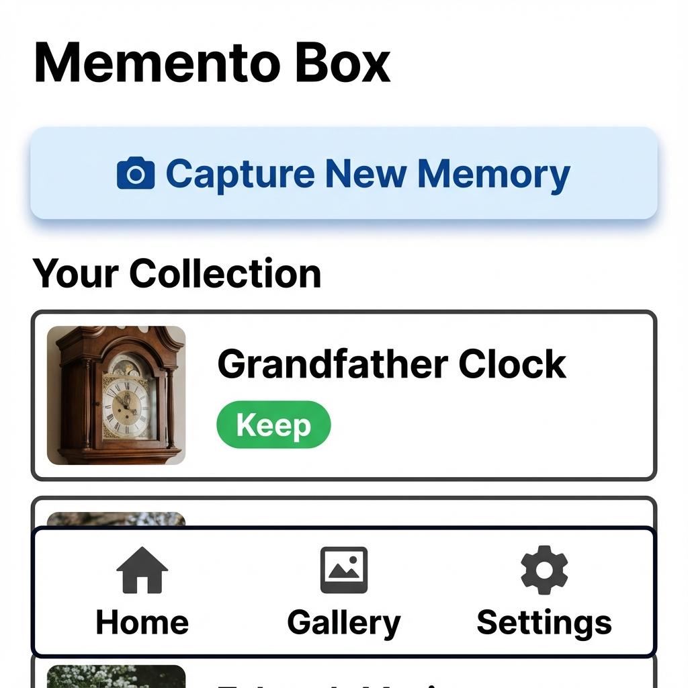
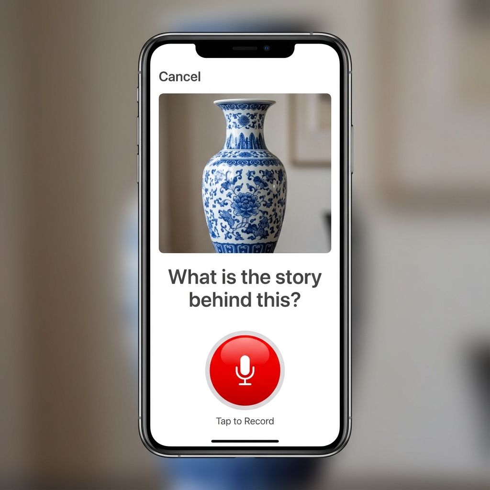
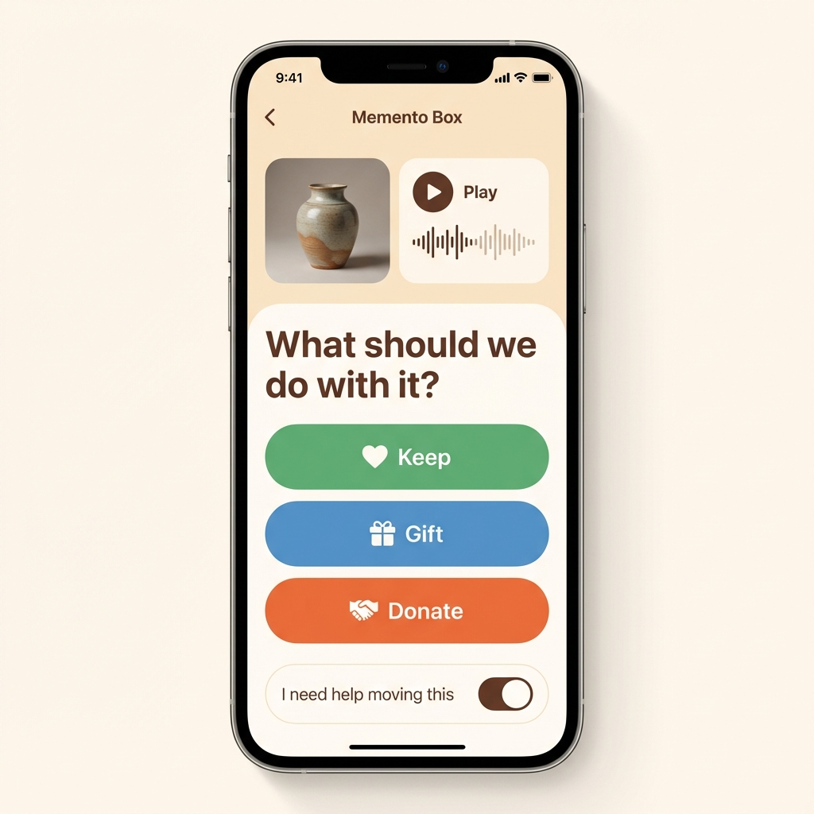

# Memento Box

> "Release the item, keep the memory."

**Memento Box** is a "Senior-First" Progressive Web App (PWA) designed to help aging adults downsize by preserving the stories attached to their physical possessions.

## 🎨 Concept Preview

### Concept Preview

*Home Screen: Your collection at a glance.*

*Capture Screen: Simple photo and audio recording.*

*Review Screen: Decide what to do with the item.*

## 🎯 Mission
To empower seniors to let go of physical clutter without losing the emotional connection to their memories, and to facilitate the transfer of family history to the next generation.

## 🛠 Jobs to Be Done (JTBD)

We are building this product to hire it for the following "Jobs":

### Job 1: The "Emotional Release"
**When** I am sorting through a lifetime of possessions and feel overwhelmed by the guilt of throwing things away...
**I want to** preserve the memory and the story attached to the object...
**So that** I can physically let go of the item without feeling like I am erasing a part of my life.

### Job 2: The "Legacy Transfer"
**When** I am deciding who should receive my cherished belongings...
**I want to** record why this item matters and who it is intended for...
**So that** my children and grandchildren understand its value and don't just see it as "stuff".

### Job 3: The "Helper's Hand"
**When** I am helping my parent downsize and we are physically separated...
**I want to** see a clear list of what needs to be moved, donated, or kept...
**So that** I can efficiently manage the logistics of the move when I visit.

### Job 4: The "Nostalgia Trip"
**When** I am sitting in my armchair and want to feel connected to my past...
**I want to** watch a passive slideshow of my items and hear my own voice telling the stories...
**So that** I can enjoy my memories without having to dig through boxes.

### Job 5: The "Living Heirloom"
**When** I give an item to my grandchild...
**I want to** attach a QR code that links to the story...
**So that** when they hold the object, they can hear me telling them why it matters.

## 👤 User Personas

1.  **The Storyteller (Primary)**: 75+ years old. Not tech-savvy. Uses an iPad or iPhone. Values memories over things but is burdened by the volume of "stuff".
2.  **The Helper (Secondary)**: Adult child (40-60s). Tech-savvy. Wants to help but is often remote. Needs clarity and organization.
3.  **The Heirloom Receiver (Tertiary)**: Grandchild. Wants to know the history of the object they inherited.

## 📖 User Stories

### Capture & Organize
- As a **Storyteller**, I want to take a photo and immediately start recording audio so I don't lose my train of thought.
- As a **Storyteller**, I want to walk around the house taking photos of many items quickly ("Batch Mode"), and then sit down later to record the stories for them.
- As a **Storyteller**, I want to tag an item as "Donate" so my children know it can go.
- As a **Storyteller**, I want to check a box saying **"I need help moving this"** for heavy items, so I remember to ask my son when he visits.

### Relive & Share
- As a **Storyteller**, I want a "Frame Mode" that plays my memories like a movie.
- As a **Storyteller**, I want to print QR code stickers for my items so I can attach the story to the physical object.
- As a **Heirloom Receiver**, I want to scan a QR code on a vase and hear Grandma's story about it.

### Logistics & Progress
- As a **Helper**, I want to filter the list by "Needs Help" so I know exactly what tasks to do when I visit.
- As a **Helper**, I want to mark items as **"Moved / Done"** so they disappear from my "Needs Help" list for next time.
- As a **Helper**, I want to mark items as "Physically Gone" (Donated/Gifted) so we can celebrate the progress made in clearing the house.

## 📜 Core Requirements (The "What")

### 1. The Capture Experience
- **Simple Inputs**: One photo, one audio recording, one status button.
- **The "Heavy" Toggle**: A simple checkbox for "I need help moving this".
- **Forgiving UI**: Undo buttons, clear confirmations, no "hidden" gestures.
- **Offline Grace**: Works in the attic (offline) but clearly communicates when data is safe (online).

### 2. The "Vault" Safety
- **Cloud-First**: Data is only "safe" when confirmed by Google Drive.
- **Ownership**: Data lives in the user's Google Drive, not our servers.

### 3. The Organization
- **Sorting**: Categories for Keep, Gift, Donate, Trash.
- **Review**: A way to sit back and review the "Drafts" before finalizing.
- **Printing**: Generate printable PDF of QR codes for selected items.

## 🚫 Constraints (The "Guardrails")
- **Senior-First Accessibility**: 18px+ font, 60px+ touch targets, high contrast.
- **No Proprietary Backend**: Must run 100% client-side.
